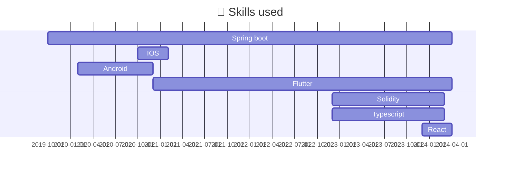

👋 Hi There, Currently I'm **mobile app developer** using flutter.📱 
I hope to continue enjoying programming as much as I do now. 😁

### 💪 Skills

 

 

```mermaid
gantt
    dateFormat  YYYY-MM
    title       💪 Skills used

    Spring boot            :    2019-10, 2024-04
    IOS                    :    2020-10, 2021-02
    Android                :    2020-02, 2020-12
    Flutter                :    2020-12, 2024-04
    Solidity               :    2022-12, 2024-03
	  Typescript              :    2022-12, 2024-03
    React                  :    2023-12, 2024-04
```

